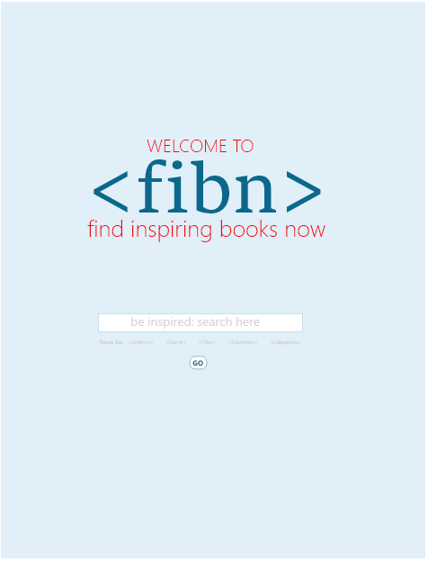
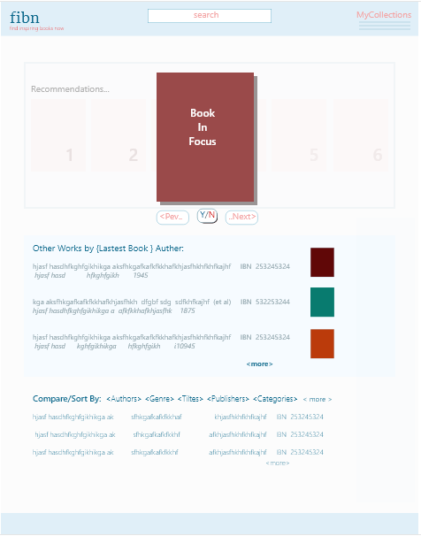

# Mod-2-Project
Project2/Perscholas

## Which 3rd party API I'm using:
api.repo.nypl.org/

## Problem statement:
### fibn: Find Inspiring Books Now. 
- An app that finds inspiring books for readers in their area(s) of interest form the collections at the Newyork Public Library. 

## Target users:
Avid readers and discerning buyers.

## Wireframe
##### This shows both the overall look as well as some of the logIn component

* Overview:
- Stateful Components:
    - (a) App.js [Populates components to the DOM]
    - (b) Book Search based on deired criteria [fetched from server]
    

- Functional Component:
    - (a) confirmation box/lightboxes/modal
    - (b) archieve of Searches

- *** FUTURE WORK  ***
    - (a) User Authentication   
    - (b) User Profiles [form USERS data]
    - (c) Book Recommendations Based on Past User Behaviour
